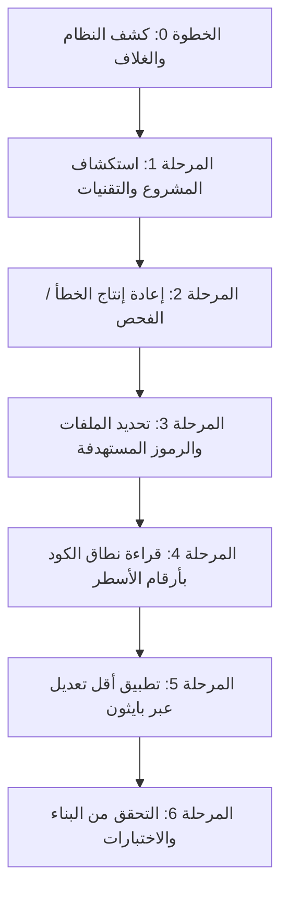

# 🚀 chat-claude-code

> **حوّل أي روبوت دردشة مدعوم بالذكاء الاصطناعي إلى Claude Code CLI من خلال حلقة ذكية للنسخ واللصق عبر الطرفية.**

---

### 🌐 الترجمات / Translations
[ English ](README.md) • [ বাংলা ](README.bn.md) • [ Español ](README.es.md) • [ 简体中文 ](README.zh.md) • [ हिन्दी ](README.hi.md) • [ Français ](README.fr.md) • [ Deutsch ](README.de.md) • [ 日本語 ](README.ja.md) • [ Português ](README.pt.md) • [ Русский ](README.ru.md) • [ العربية ](README.ar.md)

---

**`chat-claude-code`** هي مهارة سير عمل قائمة على الوكلاء ونظام توجيهات مصمم للمطورين الذين ليس لديهم وصول مباشر إلى أدوات CLI المؤتمتة (مثل Claude Code CLI). يتيح لك استخدام روبوتات الدردشة العادية (Claude Web, ChatGPT, Gemini, إلخ) لفحص واستكشاف أخطاء وإعادة هيكلة وإنشاء المشاريع البرمجية مباشرة من خلال الطرفية المحلية الخاصة بك.

---

## 🌟 الميزات الرئيسية (Key Features)

- **🔄 حلقة النسخ واللصق عبر الطرفية:** يقوم الذكاء الاصطناعي بإنشاء أوامر الطرفية خطوة بخطوة، وتحليل المخرجات الملصقة، وتطبيق تعديلات دقيقة على الشيفرة البرمجية.
- **🖥️ كشف فوري لنظام التشغيل والغلاف (Shell):** يتعرف تلقائيًا على Windows (PowerShell / CMD) أو macOS (Zsh / Bash) أو Linux في الخطوة الأولى دون سؤال المستخدم.
- **🎯 تعديلات دقيقة وآمنة:** يستخدم نصوص بايثون لاستبدال الكود بدقة مطابقة وحيدة (`assert count == 1`) لضمان عدم تلف الملفات والحفاظ على ترميز UTF-8.
- **⚡ إنشاء المشاريع بأمر واحد:** يحوّل أفكار المشاريع (مثل *Flutter + Riverpod*, *Next.js*, *Rust Axum*) إلى مشروع كامل جاهز مع التبعيات والملفات بأمر تنفيذي واحد.
- **🛡️ حماية سياق المحادثة:** يطبق حدودًا صارمة للمخرجات (`head`, `tail`, `cut`) لمنع إغراق نافذة سياق الذكاء الاصطناعي بسجلات الطرفية الطويلة.

---

## 💡 لماذا تستخدم chat-claude-code؟

| التحديات مع روبوتات الدردشة التقليدية | الحلول في chat-claude-code |
|---|---|
| **التخمين الأعمى:** يكتب الذكاء الاصطناعي أكوادًا غير صحيحة دون رؤية الهيكل الفعلي. | **الاستكشاف أولاً:** يقرأ ملفات الإعدادات والأسطر المعنية بدقة قبل اقتراح الحل. |
| **تجاوز حدود الذاكرة:** يؤدي لصق سجلات ضخمة إلى انهيار جلسة المحادثة. | **ميزانية مخرجات صارمة:** الأوامر محددة بعدد أسطر (أقصى حد 40 سطرًا، 200 حرف للسطر). |
| **أخطاء سياق الغلاف:** إعطاء أوامر لينكس لمستخدمي ويندوز يسبب أخطاء. | **كشف المنصة (الخطوة 0):** يختار تلقائيًا صيغة الأوامر المناسبة للغلاف الفعلي. |
| **أخطاء التعديل اليدوي:** استبدال الأكواد يدويًا في الملفات الطويلة عرضة للخطأ. | **نصوص بايثون دقيقة:** ينفذ نصوص استبدال ذاتية التحقق والأمان. |

---

## 🔄 كيف يعمل؟ (حلقة الـ 6 مراحل)



### 1. الخطوة 0: كشف المنصة (الدور الأول)
يرسل أمرًا شاملاً لتحديد نظام التشغيل والغلاف ومجلد المشروع:
```bash
echo "OS=%OS% SHELL=$SHELL OSTYPE=$OSTYPE PS=$PSVersionTable"
git rev-parse --show-toplevel
```

### 2. المرحلة 1: الاستكشاف (Discover)
يتعرف على إطار العمل من ملفات الإعدادات (`package.json`, `pubspec.yaml`, `Cargo.toml` وغيرها).

### 3. المرحلة 2: إعادة الإنتاج (Reproduce)
ينفذ أوامر الفحص أو البناء (مثل `npm run build`, `cargo check`, `flutter analyze`) مع تصفية المخرجات.

### 4. المرحلتان 3 و 4: التحديد والقراءة (Locate & Read)
يبحث عن الملفات بالاسم أولاً (`git ls-files`)، ثم داخل الكود المصدري (`git grep`)، ويعرض الأسطر المعنية بأرقامها.

### 5. المرحلة 5: القرار والتعديل (Decide & Fix)
يطبق أقل تغيير مطلوب باستخدام نص بايثون دقيق:

```python
from pathlib import Path
p = Path("src/services/auth.ts")
s = p.read_text(encoding="utf-8")
old = """كتلة الكود القديم"""
new = """كتلة الكود الجديد"""
assert s.count(old) == 1, f"expected 1 match, found {s.count(old)}"
p.write_text(s.replace(old, new), encoding="utf-8")
print("done")
```

---

## 🚀 دليل الاستخدام

### السيناريو A: إصلاح خطأ في مشروع موجود
1. **اشرح مشكلتك:** *"يظهر خطأ 500 عند إرسال نموذج الدفع في تطبيق Next.js."*
2. **شغّل أمر كشف النظام** المقدم من الذكاء الاصطناعي والصق النتيجة في الدردشة.
3. **شغّل الأوامر خطوة بخطوة** كما يوجهك الذكاء الاصطناعي.
4. **شغّل نص الإصلاح** وتأكد من نجاح عملية البناء.

---

### السيناريو B: إنشاء مشروع جديد من فكرة
أخبر الذكاء الاصطناعي بفكرتك:  
*"أنشئ تطبيق هاتف باستخدام Flutter و Riverpod لتتبع العادات اليومية."*

سيقوم الذكاء الاصطناعي بإنشاء نص شامل يقوم بما يلي:
1. فحص توفر الأدوات المطلوبة (`flutter`, `node` إلخ).
2. إنشاء مجلد المشروع والقالب الأساسي.
3. تثبيت الحزم والتبعيات المطلوبة.
4. كتابة جميع الملفات والشاشات وإدارة الحالة بترميز UTF-8.
5. تشغيل التحليل الثابت للتأكد من عدم وجود أخطاء.

---

## 📋 ورقة مرجعية للأوامر (Cheat Sheet)

### 🍏 macOS / 🐧 Linux (`zsh` و `bash`)

| الغرض | الأمر |
|---|---|
| **كشف المنصة** | `echo "OS=%OS% SHELL=$SHELL OSTYPE=$OSTYPE PS=$PSVersionTable"` |
| **نظرة عامة على الملفات** | `git ls-files \| head -80` |
| **البحث عن ملف بالاسم** | `git ls-files \| grep -iE "KEYWORD" \| head -30` |
| **البحث داخل الكود** | `git grep -nI -iE "KEYWORD" -- src app lib \| cut -c1-200 \| head -40` |
| **قراءة نطاق أسطر** | `awk 'NR>=30 && NR<=80 {printf "%d: %s\n", NR, $0}' path/to/file \| cut -c1-200` |
| **تصفية أخطاء البناء** | `COMMAND 2>&1 \| grep -iE "error\|warning" \| cut -c1-200 \| head -30` |
| **نسخ احتياطي آمن** | `cp file.ext file.ext.bak` |

### 🪟 Windows (`PowerShell`)

| الغرض | الأمر |
|---|---|
| **نظرة عامة على الملفات** | `git ls-files \| Select-Object -First 80` |
| **البحث عن ملف بالاسم** | `git ls-files \| Where-Object { $_ -match 'KEYWORD' } \| Select-Object -First 30` |
| **البحث داخل الكود** | `git grep -nI -iE "KEYWORD" -- src app lib \| ForEach-Object { $_.Substring(0, [Math]::Min(200, $_.Length)) } \| Select-Object -First 40` |
| **قراءة نطاق أسطر** | `$i = 30; Get-Content path\to\file \| Select-Object -Skip 29 -First 51 \| ForEach-Object { "{0}: {1}" -f $i, $_ }` |
| **تصفية أخطاء البناء** | `COMMAND 2>&1 \| Select-String -Pattern "error\|warning" \| Select-Object -First 30` |
| **نسخ احتياطي آمن** | `Copy-Item file.ext file.ext.bak` |

---

## 🔒 مبادئ الأمان والحماية

- 🛑 **منع الأوامر التدميرية:** يُحظر استخدام `rm -rf` أو `format` أو `git reset --hard` دون تأكيد مسبق.
- 🛑 **حظر تسريب الأسرار:** لا يطلب أبدًا ملفات `.env` أو مفاتيح API أو كلمات المرور.
- 🛑 **مخرجات منضبطة:** تقييد مخرجات الطرفية دائمًا لتفادي تجاوز سعة النموذج.
