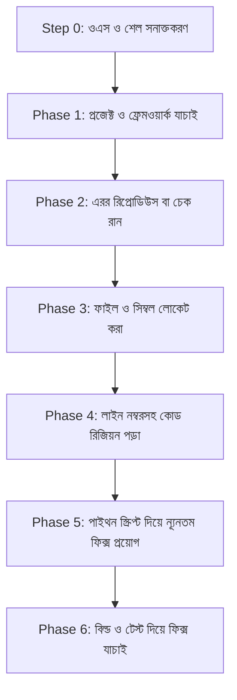

# 🚀 chat-claude-code

> **একটি বুদ্ধিমান টার্মিনাল কপি-পেস্ট লুপের মাধ্যমে যেকোনো AI চ্যাটবটকে Claude Code CLI-তে রূপান্তর করুন।**

---

### 🌐 Translations
[ English ](README.md) • [ বাংলা ](README.bn.md) • [ Español ](README.es.md) • [ 简体中文 ](README.zh.md) • [ हिन्दी ](README.hi.md) • [ Français ](README.fr.md) • [ Deutsch ](README.de.md) • [ 日本語 ](README.ja.md) • [ Português ](README.pt.md) • [ Русский ](README.ru.md) • [ العربية ](README.ar.md)

---

**`chat-claude-code`** হলো একটি এজেনটিক ওয়ার্কফ্লো স্কিল এবং প্রম্পট সিস্টেম যা এমন ডেভেলপারদের জন্য তৈরি যাদের কাছে সরাসরি Claude Code CLI-এর মতো স্বয়ংক্রিয় টুল নেই। এটি দিয়ে সাধারণ চ্যাটবট (Claude Web, ChatGPT, Gemini ইত্যাদি) ব্যবহার করে সরাসরি লোকাল টার্মিনালের মাধ্যমে কোডবেস পরিদর্শন, ডিবাগ, রিফ্যাক্টর এবং নতুন প্রজেক্ট তৈরি করা যায়।

---

## 🌟 প্রধান বৈশিষ্ট্যসমূহ (Key Features)

- **🔄 টার্মিনাল কপি-পেস্ট লুপ:** AI ধাপে ধাপে টার্মিনাল কমান্ড তৈরি করে, পেস্ট করা আউটপুট বিশ্লেষণ করে এবং সঠিক কোড পরিবর্তন সম্পাদন করে।
- **🖥️ তাৎক্ষণিক OS ও শেল সনাক্তকরণ:** ব্যবহারকারীকে জিজ্ঞাসা না করেই প্রথম ধাপে Windows (PowerShell/CMD), macOS (Zsh/Bash), বা Linux শনাক্ত করে।
- **🎯 নির্ভুল ও নিরাপদ কোড এডিট:** ফাইল সিনট্যাক্স বা এনকোডিং অক্ষত রেখে (`assert count == 1`) কোড নিখুঁতভাবে পরিবর্তন করার জন্য Python স্ক্রিপ্ট ব্যবহার করে।
- **⚡ এক ক্লিকে সম্পূর্ণ প্রজেক্ট তৈরি:** যেকোনো নতুন আইডিয়াকে (যেমন: *Flutter + Riverpod*, *Next.js*, *Rust Axum*) একটিমাত্র টার্মিনাল কমান্ডে সম্পূর্ণ স্টার্টার প্রজেক্টে রূপান্তর করে।
- **🛡️ চ্যাট কনটেক্সট সুরক্ষা:** টার্মিনাল লগ যাতে চ্যাটবটের কনটেক্সট উইন্ডো পূর্ণ না করে ফেলে, সেজন্য কঠোর আউটপুট বাজেট (`head`, `tail`, `cut`) নিশ্চিত করে।

---

## 💡 কেন chat-claude-code ব্যবহার করবেন?

| সাধারণ চ্যাটবটের সমস্যা | chat-claude-code কীভাবে সমাধান করে |
|---|---|
| **অনুমান নির্ভর কোডিং:** চ্যাটবট প্রজেক্টের আসল কাঠামো না দেখেই কোড লেখে। | **আগে অনুসন্ধান:** ফিক্স দেওয়ার আগে প্রজেক্ট ফাইল, কনফিগারেশন এবং নির্দিষ্ট লাইন পড়ে নিশ্চিত হয়। |
| **কনটেক্সট উইন্ডো শেষ হয়ে যাওয়া:** বিশাল টার্মিনাল লগ পেস্ট করলে চ্যাট সেশন নষ্ট হয়। | **হার্ড আউটপুট বাজেট:** কমান্ডগুলোতে নির্দিষ্ট লাইন লিমিট (সর্বোচ্চ ৪০ লাইন, প্রতি লাইনে ২০০ ক্যারেক্টার) দেওয়া থাকে। |
| **ভুল শেল সিনট্যাক্স:** উইন্ডোজ ব্যবহারকারীকে লিনাক্স কমান্ড দিলে এরর আসে। | **প্ল্যাটফর্ম সনাক্তকরণ (Step 0):** স্বয়ংক্রিয়ভাবে সঠিক শেল ডায়েলেক্ট বেছে নেয়। |
| **ভুল ফাইল এডিটিং:** বড় ফাইল ম্যানুয়ালি কপি-পেস্ট করা ঝামেলার ও ভুল হওয়ার ঝুঁকি থাকে। | **অ্যাটোমিক পাইথন স্ক্রিপ্ট:** স্বয়ংক্রিয় যাচাইকরণ সহ সঠিক কোড ব্লক প্রতিস্থাপন করে। |

---

## 🔄 কীভাবে কাজ করে? (৬-ধাপের এজেন্ট লুপ)



### ১. Step 0: প্ল্যাটফর্ম সনাক্তকরণ (প্রথম পদক্ষেপ)
অপারেটিং সিস্টেম, শেল এবং প্রজেক্টের রুট ডিরেক্টরি বের করার জন্য একটি সর্বজনীন কমান্ড পাঠায়:
```bash
echo "OS=%OS% SHELL=$SHELL OSTYPE=$OSTYPE PS=$PSVersionTable"
git rev-parse --show-toplevel
```

### ২. Phase 1: আবিষ্কার (Discover)
মার্কার ফাইল (`package.json`, `pubspec.yaml`, `Cargo.toml` ইত্যাদি) দেখে ফ্রেমওয়ার্ক শনাক্ত করে।

### ৩. Phase 2: রিপ্রোডিউস (Reproduce)
বিল্ড বা চেক কমান্ড (যেমন: `npm run build`, `cargo check`, `flutter analyze`) চালিয়ে এরর ফিল্টার করে।

### ৪. Phase 3 & 4: লোকেট ও পড়া (Locate & Read)
প্রথমে নাম দিয়ে ফাইল খুঁজে বের করে (`git ls-files`), সোর্স ফোল্ডারে সার্চ করে (`git grep`), এবং লাইন নম্বরসহ কোড পড়ে।

### ৫. Phase 5: সিদ্ধান্ত ও ফিক্স (Decide & Fix)
একটি অ্যাটোমিক পাইথন স্ক্রিপ্ট দিয়ে কোড পরিবর্তন প্রয়োগ করে:

```python
from pathlib import Path
p = Path("src/services/auth.ts")
s = p.read_text(encoding="utf-8")
old = """পুরোনো কোড ব্লক"""
new = """নতুন কোড ব্লক"""
assert s.count(old) == 1, f"expected 1 match, found {s.count(old)}"
p.write_text(s.replace(old, new), encoding="utf-8")
print("done")
```

---

## 🚀 ব্যবহারের নির্দেশিকা

### সিনারিও A: চলমান প্রজেক্টে বাগ ফিক্স করা
1. চ্যাটে আপনার সমস্যা বলুন: *"আমার Next.js অ্যাপের চেকআউট ফর্মে ৫০০ এরর আসছে।"*
2. AI-এর দেওয়া প্ল্যাটফর্ম ডিটেকশন কমান্ডটি টার্মিনালে রান করে আউটপুট চ্যাটে পেস্ট করুন।
3. AI আপনাকে যে কমান্ডগুলো দেবে সেগুলো ধাপে ধাপে টার্মিনালে রান করে রেজাল্ট দিন।
4. AI-এর দেওয়া ফিক্স স্ক্রিপ্ট রান করুন এবং বিল্ড চেক দিয়ে নিশ্চিত হোন।

---

### সিনারিও B: নতুন আইডিয়া থেকে প্রজেক্ট স্ক্যাফোল্ডিং
AI-কে আপনার আইডিয়া বলুন:  
*"Flutter ও Riverpod ব্যবহার করে একটি হ্যাবিট ট্র্যাকিং মোবাইল অ্যাপ বানিয়ে দাও।"*

AI একটি একক পাইথন/শেল স্ক্রিপ্ট জেনারেট করবে যা:
1. প্রয়োজনীয় টুলিং চেক করবে (`flutter`, `node` ইত্যাদি)।
2. প্রজেক্ট ফোল্ডার এবং টেমপ্লেট তৈরি করবে।
3. প্রয়োজনীয় প্যাকেজগুলো ইনস্টল করবে।
4. সমস্ত স্টার্টার কোড, স্ক্রিন এবং স্টেট প্রোভাইডার ফাইল লিখে দেবে।
5. কোড ঠিকমতো কম্পাইল হয় কি না তা অ্যানালাইজ করে কনফার্ম করবে।

---

## 📋 কমান্ড চিট শিট (Command Cheat Sheet)

### 🍏 macOS / 🐧 Linux (`zsh` ও `bash`)

| উদ্দেশ্য | কমান্ড |
|---|---|
| **প্ল্যাটফর্ম সনাক্তকরণ** | `echo "OS=%OS% SHELL=$SHELL OSTYPE=$OSTYPE PS=$PSVersionTable"` |
| **প্রজেক্টের ফাইল তালিকা** | `git ls-files \| head -80` |
| **নাম দিয়ে ফাইল খোঁজা** | `git ls-files \| grep -iE "KEYWORD" \| head -30` |
| **সোর্সের ভেতর সার্চ** | `git grep -nI -iE "KEYWORD" -- src app lib \| cut -c1-200 \| head -40` |
| **নির্দিষ্ট লাইন পড়া** | `awk 'NR>=30 && NR<=80 {printf "%d: %s\n", NR, $0}' path/to/file \| cut -c1-200` |
| **বিল্ড এরর ফিল্টার করা** | `COMMAND 2>&1 \| grep -iE "error\|warning" \| cut -c1-200 \| head -30` |
| **নিরাপদ ব্যাকআপ** | `cp file.ext file.ext.bak` |

### 🪟 Windows (`PowerShell`)

| উদ্দেশ্য | কমান্ড |
|---|---|
| **প্রজেক্টের ফাইল তালিকা** | `git ls-files \| Select-Object -First 80` |
| **নাম দিয়ে ফাইল খোঁজা** | `git ls-files \| Where-Object { $_ -match 'KEYWORD' } \| Select-Object -First 30` |
| **সোর্সের ভেতর সার্চ** | `git grep -nI -iE "KEYWORD" -- src app lib \| ForEach-Object { $_.Substring(0, [Math]::Min(200, $_.Length)) } \| Select-Object -First 40` |
| **নির্দিষ্ট লাইন পড়া** | `$i = 30; Get-Content path\to\file \| Select-Object -Skip 29 -First 51 \| ForEach-Object { "{0}: {1}" -f $i, $_ }` |
| **বিল্ড এরর ফিল্টার করা** | `COMMAND 2>&1 \| Select-String -Pattern "error\|warning" \| Select-Object -First 30` |
| **নিরাপদ ব্যাকআপ** | `Copy-Item file.ext file.ext.bak` |

---

## 🔒 নিরাপত্তা ও সেফটি নীতিমালা

- 🛑 **কোনো ক্ষতিকর কমান্ড নয়:** `rm -rf`, `format`, `git reset --hard`, `git push --force` অনুমতি এবং ব্যাকআপ ছাড়া চালানো নিষেধ।
- 🛑 **কোনো গোপন তথ্য নয়:** `.env` ফাইল, API কী বা পাসওয়ার্ড কখনো চ্যাটে পেস্ট করতে বলে না।
- 🛑 **সীমাবদ্ধ আউটপুট:** চ্যাট ক্র্যাশ রোধে সবসময় টার্মিনাল আউটপুটের লাইন সংখ্যা সীমাবদ্ধ রাখা হয়।
