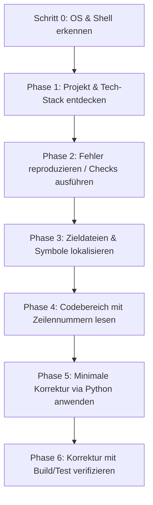

# 🚀 chat-claude-code

> **Verwandeln Sie jeden KI-Chatbot über eine intelligente Terminal-Copy-Paste-Schleife in Claude Code CLI.**

---

### 🌐 Übersetzungen / Translations
[ English ](README.md) • [ বাংলা ](README.bn.md) • [ Español ](README.es.md) • [ 简体中文 ](README.zh.md) • [ हिन्दी ](README.hi.md) • [ Français ](README.fr.md) • [ Deutsch ](README.de.md) • [ 日本語 ](README.ja.md) • [ Português ](README.pt.md) • [ Русский ](README.ru.md) • [ العربية ](README.ar.md)

---

**`chat-claude-code`** ist ein agentenbasiertes Workflow- und Prompt-System für Entwickler, die keinen direkten Zugriff auf automatisierte CLI-Tools (wie Claude Code CLI) haben und Standard-KI-Chatbots (Claude Web, ChatGPT, Gemini usw.) verwenden möchten, um Codebasen direkt über das lokale Terminal zu untersuchen, zu debuggen, zu refaktorieren und neue Projekte zu erstellen.

---

## 🌟 Hauptmerkmale

- **🔄 Terminal-Copy-Paste-Schleife:** Die KI generiert schrittweise Terminalbefehle, analysiert die von Ihnen eingefügte Ausgabe und führt präzise Codeänderungen durch.
- **🖥️ Sofortige OS- & Shell-Erkennung:** Erkennt im ersten Schritt automatisch Windows (PowerShell / CMD), macOS (Zsh / Bash) oder Linux, ohne den Benutzer zu fragen.
- **🎯 Präzise und sichere Code-Edits:** Verwendet Python-Ersetzungsskripte mit exakter Übereinstimmung (`assert count == 1`), um Syntaxfehler und Encoding-Probleme (UTF-8-sicher) zu vermeiden.
- **⚡ Ein-Befehl-Projekt-Scaffolding:** Verwandelt Projektideen (z. B. *Flutter + Riverpod*, *Next.js*, *Rust Axum*) mit einem einzigen Befehl in ein vollständiges Startprojekt mit allen Abhängigkeiten und Dateien.
- **🛡️ Schutz des Chat-Kontextes:** Setzt strenge Ausgabebeschränkungen (`head`, `tail`, `cut`) durch, um ein Überlaufen des KI-Kontextfensters zu verhindern.

---

## 💡 Warum chat-claude-code verwenden?

| Problem bei Standard-Chatbots | Lösung durch chat-claude-code |
|---|---|
| **Blindes Raten:** Chatbots schreiben fehlerhaften Code, ohne die reale Struktur zu kennen. | **Zuerst erkunden:** Liest Projektstruktur, Konfigurationsdateien und exakte Codezeilen. |
| **Kontextüberlauf:** Große Terminalausgaben überlasten die Chatsitzung. | **Striktes Ausgabebudget:** Befehle sind limitiert (max. 40 Zeilen, 200 Zeichen/Zeile). |
| **Falsche Shell-Syntax:** Linux-Befehle unter Windows führen zu Fehlern. | **Plattform-Erkennung (Step 0):** Wählt automatisch den korrekten Shell-Dialekt. |
| **Fehlerhafte manuelle Edits:** Manuelles Einfügen von Codeblöcken ist fehleranfällig. | **Atomare Python-Skripte:** Führt selbstprüfende Ersetzungsskripte aus. |

---

## 🔄 Wie es funktioniert (Der 6-Phasen-Ablauf)



### 1. Schritt 0: Plattform-Erkennung (Erster Schritt)
Sendet einen universellen Befehl zur Identifizierung von Betriebssystem, Shell und Projektpfad:
```bash
echo "OS=%OS% SHELL=$SHELL OSTYPE=$OSTYPE PS=$PSVersionTable"
git rev-parse --show-toplevel
```

### 2. Phase 1: Entdecken
Erkennt das Framework (Node, Flutter, Rust, Python, Go, Android, LaTeX) anhand von Marker-Dateien (`package.json`, `pubspec.yaml`, `Cargo.toml` usw.).

### 3. Phase 2: Reproduzieren
Führt Prüfbefehle (z. B. `npm run build`, `cargo check`, `flutter analyze`) mit gefilterter Ausgabe aus.

### 4. Phase 3 & 4: Lokalisieren & Lesen
Findet Dateien nach Namen (`git ls-files`), durchsucht Quellcode (`git grep`) und liest relevante Zeilenbereiche.

### 5. Phase 5: Korrektur anwenden
Wendet die kleinste erforderliche Änderung mit einem atomaren Python-Skript an:

```python
from pathlib import Path
p = Path("src/services/auth.ts")
s = p.read_text(encoding="utf-8")
old = """ALTER CODEBLOCK"""
new = """NEUER CODEBLOCK"""
assert s.count(old) == 1, f"expected 1 match, found {s.count(old)}"
p.write_text(s.replace(old, new), encoding="utf-8")
print("done")
```

---

## 🚀 Nutzungsanleitung

### Szenario A: Fehler in bestehendem Projekt beheben
1. **Problem schildern:** *"Ich erhalte einen 500-Fehler beim Absenden des Checkout-Formulars in Next.js."*
2. **Erkennungsbefehl ausführen** und Ausgabe in den Chat einfügen.
3. **Befehle schrittweise ausführen**, während die KI das Problem eingrenzt.
4. **Korrekturskript anwenden** und prüfen, ob der Build erfolgreich durchläuft.

---

### Szenario B: Neues Projekt aus Idee erstellen
Idee an die KI übermitteln:  
*"Erstelle eine Flutter-App mit Riverpod zum Verfolgen von Gewohnheiten."*

Die KI generiert ein umfassendes Setup-Skript, welches:
1. Voraussetzungen überprüft (`flutter`, `node` etc.).
2. Projektstruktur und Vorlage initialisiert.
3. Alle benötigten Pakete installiert.
4. Starter-Code, Screens und State-Provider in UTF-8 schreibt.
5. Statische Code-Analyse zur Bestätigung ausführt.

---

## 📋 Befehls-Spickzettel (Cheat Sheet)

### 🍏 macOS / 🐧 Linux (`zsh` & `bash`)

| Zweck | Befehl |
|---|---|
| **Plattform-Erkennung** | `echo "OS=%OS% SHELL=$SHELL OSTYPE=$OSTYPE PS=$PSVersionTable"` |
| **Projektübersicht** | `git ls-files \| head -80` |
| **Datei nach Name finden** | `git ls-files \| grep -iE "KEYWORD" \| head -30` |
| **Im Quellcode suchen** | `git grep -nI -iE "KEYWORD" -- src app lib \| cut -c1-200 \| head -40` |
| **Zeilenbereich lesen** | `awk 'NR>=30 && NR<=80 {printf "%d: %s\n", NR, $0}' path/to/file \| cut -c1-200` |
| **Build-Fehler filtern** | `COMMAND 2>&1 \| grep -iE "error\|warning" \| cut -c1-200 \| head -30` |
| **Sicheres Backup** | `cp file.ext file.ext.bak` |

### 🪟 Windows (`PowerShell`)

| Zweck | Befehl |
|---|---|
| **Projektübersicht** | `git ls-files \| Select-Object -First 80` |
| **Datei nach Name finden** | `git ls-files \| Where-Object { $_ -match 'KEYWORD' } \| Select-Object -First 30` |
| **Im Quellcode suchen** | `git grep -nI -iE "KEYWORD" -- src app lib \| ForEach-Object { $_.Substring(0, [Math]::Min(200, $_.Length)) } \| Select-Object -First 40` |
| **Zeilenbereich lesen** | `$i = 30; Get-Content path\to\file \| Select-Object -Skip 29 -First 51 \| ForEach-Object { "{0}: {1}" -f $i, $_ }` |
| **Build-Fehler filtern** | `COMMAND 2>&1 \| Select-String -Pattern "error\|warning" \| Select-Object -First 30` |
| **Sicheres Backup** | `Copy-Item file.ext file.ext.bak` |

---

## 🔒 Sicherheitsrichtlinien

- 🛑 **Keine zerstörerischen Befehle:** `rm -rf`, `format`, `git reset --hard` sind ohne Bestätigung untersagt.
- 🛑 **Keine Geheimnisse teilen:** Fragt niemals nach `.env`-Dateien, API-Schlüsseln oder Passwörtern.
- 🛑 **Begrenzte Terminalausgabe:** Hält Ausgaben kompakt, um Überlastung zu verhindern.
