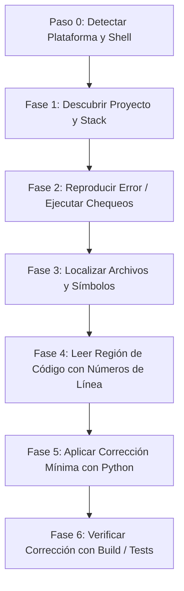

# 🚀 chat-claude-code

> **Convierte cualquier chatbot de IA en Claude Code CLI mediante un bucle inteligente de copiar y pegar en la terminal.**

<p align="left">
  <a href="https://www.supportkori.com/apon133" target="_blank">
    
  </a>
</p>


---

### 🌐 Traducciones
[ English ](README.md) • [ বাংলা ](README.bn.md) • [ Español ](README.es.md) • [ 简体中文 ](README.zh.md) • [ हिन्दी ](README.hi.md) • [ Français ](README.fr.md) • [ Deutsch ](README.de.md) • [ 日本語 ](README.ja.md) • [ Português ](README.pt.md) • [ Русский ](README.ru.md) • [ العربية ](README.ar.md)

---

**`chat-claude-code`** es una habilidad de flujo de trabajo agéntico y un sistema de instrucciones diseñado para desarrolladores que no tienen acceso directo a herramientas CLI automatizadas (como Claude Code CLI) y desean usar chatbots de IA estándar (Claude Web, ChatGPT, Gemini, etc.) para inspeccionar, depurar, refactorizar y crear proyectos directamente a través de su terminal local.

---

## 🌟 Características Principales

- **🔄 Bucle de Copiar y Pegar en Terminal:** La IA te guía paso a paso generando comandos de terminal, analizando la salida que pegas y ejecutando cambios de código exactos.
- **🖥️ Detección Instantánea de SO y Shell:** Detecta automáticamente Windows (PowerShell / CMD), macOS (Zsh / Bash) o Linux en el primer paso sin preguntarle al usuario.
- **🎯 Ediciones Precisas y Seguras:** Utiliza scripts de reemplazo en Python (`assert count == 1`) para garantizar que el código se modifique con precisión sin alterar la sintaxis ni la codificación (compatible con UTF-8).
- **⚡ Andamiaje en un Solo Comando:** Convierte ideas de proyectos (p. ej., *Flutter + Riverpod*, *Next.js*, *Rust Axum*) en un proyecto inicial completo con dependencias y archivos listos mediante un único comando ejecutable.
- **🛡️ Protección del Contexto del Chat:** Implementa límites de salida estrictos (`head`, `tail`, `cut`) para evitar que los registros de la terminal sobrecarguen la ventana de contexto de la IA.

---

## 💡 ¿Por qué usar chat-claude-code?

| Desafío con Chatbots Estándar | Cómo lo resuelve chat-claude-code |
|---|---|
| **Adivinanza a ciegas:** Los chatbots suelen escribir código incorrecto sin ver la estructura real. | **Descubrir primero:** Lee la estructura del proyecto, archivos de configuración y líneas exactas antes de proponer una solución. |
| **Sobrecarga de contexto:** Pegar registros enormes de la terminal arruina la sesión. | **Límite estricto de salida:** Los comandos están limitados (máx. 40 líneas, 200 caracteres/línea) para ahorrar tokens. |
| **Errores de sintaxis de Shell:** Dar comandos de Linux a usuarios de Windows provoca errores. | **Detección de plataforma (Paso 0):** Identifica automáticamente el dialecto de shell correcto. |
| **Ediciones de archivos rotas:** Los bloques de código manuales son propensos a errores al aplicarse. | **Scripts Atómicos en Python:** Ejecuta scripts de reemplazo autoverificables con seguridad. |

---

## 🔄 ¿Cómo funciona? (El bucle de 6 fases)



### 1. Paso 0: Detección de Plataforma (Primer Turno)
Envía un comando universal para detectar el sistema operativo, la shell y la raíz del proyecto:
```bash
echo "OS=%OS% SHELL=$SHELL OSTYPE=$OSTYPE PS=$PSVersionTable"
git rev-parse --show-toplevel
```

### 2. Fase 1: Descubrir
Identifica el framework (Node, Flutter, Rust, Python, Go, Android, LaTeX) mediante archivos clave (`package.json`, `pubspec.yaml`, `Cargo.toml`, etc.).

### 3. Fase 2: Reproducir
Ejecuta el comando de compilación o verificación (p. ej., `npm run build`, `cargo check`, `flutter analyze`) con salida filtrada.

### 4. Fases 3 y 4: Localizar y Leer
Encuentra archivos por nombre primero (`git ls-files`), busca dentro del código fuente (`git grep`) y muestra el rango de líneas relevante con números exactos.

### 5. Fase 5: Decidir y Corregir
Aplica el cambio más pequeño necesario mediante un script de reemplazo atómico en Python:

```python
from pathlib import Path
p = Path("src/services/auth.ts")
s = p.read_text(encoding="utf-8")
old = """BLOQUE DE CODIGO ANTERIOR"""
new = """NUEVO BLOQUE DE CODIGO"""
assert s.count(old) == 1, f"expected 1 match, found {s.count(old)}"
p.write_text(s.replace(old, new), encoding="utf-8")
print("done")
```

---

## 🚀 Guía de Uso

### Escenario A: Depuración de un Proyecto Existente
1. **Explica tu problema:** *"Tengo un error 500 al enviar el formulario de pago en mi app de Next.js."*
2. **Ejecuta el comando de detección** proporcionado por la IA y pega la respuesta en el chat.
3. **Ejecuta los comandos paso a paso** a medida que la IA investiga.
4. **Ejecuta el script de corrección** y verifica que la compilación pase exitosamente.

---

### Escenario B: Creación de un Nuevo Proyecto desde Cero
Indica tu idea a la IA:  
*"Crea una aplicación móvil en Flutter con Riverpod para seguimiento de hábitos."*

La IA generará un único script de configuración que:
1. Comprueba las herramientas necesarias (`flutter`, `node`, etc.).
2. Crea la estructura del proyecto y su plantilla.
3. Instala los paquetes y dependencias requeridos.
4. Escribe todo el código inicial, pantallas y proveedores de estado con UTF-8.
5. Ejecuta un análisis estático para confirmar que no hay errores.

---

## 📋 Hoja de Trucos de Comandos (Cheat Sheet)

### 🍏 macOS / 🐧 Linux (`zsh` y `bash`)

| Propósito | Comando |
|---|---|
| **Detección de Plataforma** | `echo "OS=%OS% SHELL=$SHELL OSTYPE=$OSTYPE PS=$PSVersionTable"` |
| **Resumen del Proyecto** | `git ls-files \| head -80` |
| **Buscar Archivo por Nombre** | `git ls-files \| grep -iE "KEYWORD" \| head -30` |
| **Buscar en Código Fuente** | `git grep -nI -iE "KEYWORD" -- src app lib \| cut -c1-200 \| head -40` |
| **Leer Rango de Líneas** | `awk 'NR>=30 && NR<=80 {printf "%d: %s\n", NR, $0}' path/to/file \| cut -c1-200` |
| **Filtrar Errores de Build** | `COMMAND 2>&1 \| grep -iE "error\|warning" \| cut -c1-200 \| head -30` |
| **Copia de Seguridad Segura** | `cp file.ext file.ext.bak` |

### 🪟 Windows (`PowerShell`)

| Propósito | Comando |
|---|---|
| **Resumen del Proyecto** | `git ls-files \| Select-Object -First 80` |
| **Buscar Archivo por Nombre** | `git ls-files \| Where-Object { $_ -match 'KEYWORD' } \| Select-Object -First 30` |
| **Buscar en Código Fuente** | `git grep -nI -iE "KEYWORD" -- src app lib \| ForEach-Object { $_.Substring(0, [Math]::Min(200, $_.Length)) } \| Select-Object -First 40` |
| **Leer Rango de Líneas** | `$i = 30; Get-Content path\to\file \| Select-Object -Skip 29 -First 51 \| ForEach-Object { "{0}: {1}" -f $i, $_ }` |
| **Filtrar Errores de Build** | `COMMAND 2>&1 \| Select-String -Pattern "error\|warning" \| Select-Object -First 30` |
| **Copia de Seguridad Segura** | `Copy-Item file.ext file.ext.bak` |

---

## 🔒 Principios de Seguridad

- 🛑 **Sin Comandos Destructivos:** Prohibido usar `rm -rf`, `format`, `git reset --hard` o `git push --force` sin confirmación y respaldo explícito.
- 🛑 **Protección de Secretos:** Nunca solicita ni muestra archivos `.env`, claves API o tokens privados.
- 🛑 **Salida Limitada:** Siempre acota las respuestas de la terminal para evitar desbordar la memoria de la IA.
