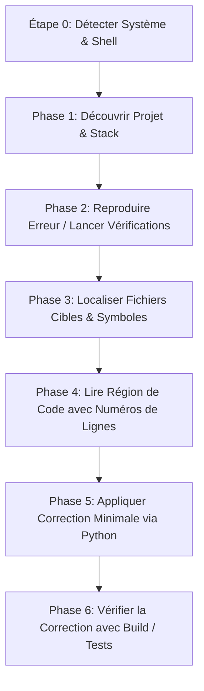

# 🚀 chat-claude-code

> **Transformez n'importe quel chatbot IA en Claude Code CLI grâce à une boucle terminale intelligente de copier-coller.**

<p align="left">
  <a href="https://www.supportkori.com/apon133" target="_blank">
    
  </a>
</p>


---

### 🌐 Traductions / Translations
[ English ](README.md) • [ বাংলা ](README.bn.md) • [ Español ](README.es.md) • [ 简体中文 ](README.zh.md) • [ हिन्दी ](README.hi.md) • [ Français ](README.fr.md) • [ Deutsch ](README.de.md) • [ 日本語 ](README.ja.md) • [ Português ](README.pt.md) • [ Русский ](README.ru.md) • [ العربية ](README.ar.md)

---

**`chat-claude-code`** est une compétence de flux de travail agentique conçue pour les développeurs n'ayant pas accès aux outils CLI automatisés (comme Claude Code CLI). Il permet d'utiliser des chatbots IA standards (Claude Web, ChatGPT, Gemini, etc.) pour inspecter, déboguer, refactoriser et générer des projets directement via le terminal local.

---

## 🌟 Fonctionnalités Clés

- **🔄 Boucle Copier-Coller dans le Terminal :** L'IA génère des commandes pas à pas, analyse vos sorties et applique les modifications de code avec exactitude.
- **🖥️ Détection Instantanée du Système et du Shell :** Identifie automatiquement Windows (PowerShell / CMD), macOS (Zsh / Bash) ou Linux dès la première étape sans intervention de l'utilisateur.
- **🎯 Modifications Précises et Sûres :** Utilise des scripts Python de remplacement à correspondance unique (`assert count == 1`) pour modifier le code sans altérer l'encodage (compatible UTF-8).
- **⚡ Échafaudage de Projet en une Seule Commande :** Transforme vos idées (ex. : *Flutter + Riverpod*, *Next.js*, *Rust Axum*) en un projet complet prêt à l'emploi via une seule commande.
- **🛡️ Protection du Contexte de Chat :** Applique un budget de sortie strict (`head`, `tail`, `cut`) pour éviter d'engorger la fenêtre de contexte de l'IA.

---

## 💡 Pourquoi utiliser chat-claude-code ?

| Problème avec les Chatbots Classiques | Solution apportée par chat-claude-code |
|---|---|
| **Devinettes à l'aveugle :** L'IA propose du code erroné sans voir la structure réelle. | **Découverte d'abord :** Lit l'arborescence, les fichiers de configuration et les lignes exactes. |
| **Saturation du contexte :** Coller de longs journaux de terminal fait planter la session. | **Budget de sortie strict :** Limite les résultats (max. 40 lignes, 200 caractères/ligne). |
| **Erreurs de syntaxe Shell :** Donner des commandes Linux à un utilisateur Windows échoue. | **Détection de plateforme (Étape 0) :** Sélectionne la syntaxe adaptée au shell actif. |
| **Modifications manuelles risquées :** Modifier des fichiers à la main est source d'erreurs. | **Scripts Python Atomiques :** Exécute des scripts de remplacement avec vérification automatique. |

---

## 🔄 Comment ça marche ? (La boucle en 6 phases)



### 1. Étape 0 : Détection de la Plateforme (Premier Tour)
Envoie une commande universelle pour identifier le système d'exploitation, le shell et la racine du projet :
```bash
echo "OS=%OS% SHELL=$SHELL OSTYPE=$OSTYPE PS=$PSVersionTable"
git rev-parse --show-toplevel
```

### 2. Phase 1 : Découverte
Identifie le framework (Node, Flutter, Rust, Python, Go, Android, LaTeX) via les fichiers marqueurs (`package.json`, `pubspec.yaml`, `Cargo.toml`, etc.).

### 3. Phase 2 : Reproduction
Lance la commande de vérification (ex. : `npm run build`, `cargo check`, `flutter analyze`) avec sortie filtrée.

### 4. Phases 3 & 4 : Localisation & Lecture
Trouve les fichiers par nom (`git ls-files`), cherche dans le code source (`git grep`), puis lit les lignes pertinentes.

### 5. Phase 5 : Décision & Correction
Applique la modification minimale requise avec un script Python autonome :

```python
from pathlib import Path
p = Path("src/services/auth.ts")
s = p.read_text(encoding="utf-8")
old = """ANCIEN BLOC DE CODE"""
new = """NOUVEAU BLOC DE CODE"""
assert s.count(old) == 1, f"expected 1 match, found {s.count(old)}"
p.write_text(s.replace(old, new), encoding="utf-8")
print("done")
```

---

## 🚀 Guide d'Utilisation

### Scénario A : Déboguer un Projet Existant
1. **Expliquez votre problème :** *"J'ai une erreur 500 lors de la soumission du formulaire dans mon app Next.js."*
2. **Exécutez la commande de détection** fournie par l'IA et collez la réponse dans le chat.
3. **Exécutez les commandes étape par étape** selon les instructions de l'IA.
4. **Appliquez le script de correction** et vérifiez que le build passe.

---

### Scénario B : Générer un Nouveau Projet
Indiquez votre idée à l'IA :  
*"Crée une application mobile Flutter avec Riverpod pour le suivi des habitudes."*

L'IA générera un script unique complet qui :
1. Vérifie les prérequis (`flutter`, `node`, etc.).
2. Initialise le projet et sa structure.
3. Installe les dépendances nécessaires.
4. Génère tout le code de démarrage, les écrans et l'état en UTF-8.
5. Effectue une analyse statique pour confirmer l'absence d'erreurs.

---

## 📋 Aide-Mémoire des Commandes (Cheat Sheet)

### 🍏 macOS / 🐧 Linux (`zsh` & `bash`)

| Objectif | Commande |
|---|---|
| **Détection Plateforme** | `echo "OS=%OS% SHELL=$SHELL OSTYPE=$OSTYPE PS=$PSVersionTable"` |
| **Aperçu du Projet** | `git ls-files \| head -80` |
| **Trouver un Fichier** | `git ls-files \| grep -iE "KEYWORD" \| head -30` |
| **Chercher dans le Code** | `git grep -nI -iE "KEYWORD" -- src app lib \| cut -c1-200 \| head -40` |
| **Lire des Lignes** | `awk 'NR>=30 && NR<=80 {printf "%d: %s\n", NR, $0}' path/to/file \| cut -c1-200` |
| **Filtrer les Erreurs** | `COMMAND 2>&1 \| grep -iE "error\|warning" \| cut -c1-200 \| head -30` |
| **Sauvegarde Sécurisée** | `cp file.ext file.ext.bak` |

### 🪟 Windows (`PowerShell`)

| Objectif | Commande |
|---|---|
| **Aperçu du Projet** | `git ls-files \| Select-Object -First 80` |
| **Trouver un Fichier** | `git ls-files \| Where-Object { $_ -match 'KEYWORD' } \| Select-Object -First 30` |
| **Chercher dans le Code** | `git grep -nI -iE "KEYWORD" -- src app lib \| ForEach-Object { $_.Substring(0, [Math]::Min(200, $_.Length)) } \| Select-Object -First 40` |
| **Lire des Lignes** | `$i = 30; Get-Content path\to\file \| Select-Object -Skip 29 -First 51 \| ForEach-Object { "{0}: {1}" -f $i, $_ }` |
| **Filtrer les Erreurs** | `COMMAND 2>&1 \| Select-String -Pattern "error\|warning" \| Select-Object -First 30` |
| **Sauvegarde Sécurisée** | `Copy-Item file.ext file.ext.bak` |

---

## 🔒 Principes de Sécurité

- 🛑 **Aucune Commande Destructrice :** `rm -rf`, `format`, `git reset --hard` sont interdits sans confirmation explicite.
- 🛑 **Zéro Fuite de Données Secrètes :** Ne demande jamais de clés API, mots de passe ou fichiers `.env`.
- 🛑 **Sortie Limitée :** Préserve la mémoire du modèle en évitant les flux de texte infinis.
