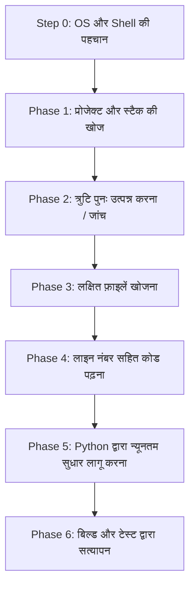

# 🚀 chat-claude-code

> **एक स्मार्ट टर्मिनल कॉपी-पेस्ट लूप के माध्यम से किसी भी AI चैटबॉट को Claude Code CLI में बदलें।**

<p align="left">
  <a href="https://www.supportkori.com/apon133" target="_blank">
    
  </a>
</p>


---

### 🌐 भाषा अनुवाद / Translations
[ English ](README.md) • [ বাংলা ](README.bn.md) • [ Español ](README.es.md) • [ 简体中文 ](README.zh.md) • [ हिन्दी ](README.hi.md) • [ Français ](README.fr.md) • [ Deutsch ](README.de.md) • [ 日本語 ](README.ja.md) • [ Português ](README.pt.md) • [ Русский ](README.ru.md) • [ العربية ](README.ar.md)

---

**`chat-claude-code`** एक एजेंटिक वर्कफ़्लो स्किल और प्रॉम्प्ट सिस्टम है जो उन डेवलपर्स के लिए डिज़ाइन किया गया है जिनके पास स्वचालित CLI टूल्स (जैसे Claude Code CLI) तक सीधी पहुंच नहीं है और वे मानक AI चैटबॉट्स (Claude Web, ChatGPT, Gemini, आदि) का उपयोग करके सीधे अपने स्थानीय टर्मिनल के माध्यम से कोडबेस का निरीक्षण, डिबग, रीफैक्टर और प्रोजेक्ट का निर्माण करना चाहते हैं।

---

## 🌟 मुख्य विशेषताएं (Key Features)

- **🔄 टर्मिनल कॉपी-पेस्ट लूप:** AI टर्मिनल कमांड उत्पन्न करता है, आपके द्वारा पेस्ट किए गए आउटपुट का विश्लेषण करता है, और सटीक कोड परिवर्तन निष्पादित करता है।
- **🖥️ तुरंत OS और Shell का पता लगाना:** उपयोगकर्ता से पूछे बिना पहले चरण में ही Windows (PowerShell / CMD), macOS (Zsh / Bash), या Linux का स्वचालित रूप से पता लगाता है।
- **🎯 सटीक और सुरक्षित कोड संपादन:** UTF-8 एन्कोडिंग और सिंटैक्स को बिना नुकसान पहुंचाए कोड बदलने के लिए सटीक-मिलान Python स्क्रिप्ट (`assert count == 1`) का उपयोग करता है।
- **⚡ एक कमांड में पूरा प्रोजेक्ट बनाएं:** प्रोजेक्ट के विचारों (जैसे *Flutter + Riverpod*, *Next.js*, *Rust Axum*) को एक ही निष्पादन योग्य कमांड में सभी निर्भरताओं और फ़ाइलों के साथ तैयार करता है।
- **🛡️ चैट संदर्भ सुरक्षा:** टर्मिनल लॉग्स को AI की संदर्भ विंडो को भरने से रोकने के लिए सख्त आउटपुट बजट (`head`, `tail`, `cut`) लागू करता है।

---

## 💡 chat-claude-code का उपयोग क्यों करें?

| सामान्य चैटबॉट्स की समस्या | chat-claude-code इसे कैसे हल करता है |
|---|---|
| **अंधाधुंध अनुमान:** चैटबॉट वास्तविक कोडबेस देखे बिना गलत कोड लिखते हैं। | **पहले खोजें:** समाधान देने से पहले प्रोजेक्ट संरचना, कॉन्फ़िगरेशन और सटीक लाइनें पढ़ता है। |
| **संदर्भ सीमा समाप्त होना:** भारी टर्मिनल आउटपुट पेस्ट करने से चैट सत्र क्रैश हो जाता है। | **सख्त आउटपुट बजट:** टोकन बचाने के लिए कमांड सीमित (अधिकतम 40 लाइनें, 200 वर्ण/लाइन) होते हैं। |
| **शेल सिंटैक्स त्रुटियां:** विंडोज उपयोगकर्ताओं को लिनक्स कमांड देने से त्रुटियां आती हैं। | **प्लेटफ़ॉर्म डिटेक्शन (Step 0):** सही शेल डायलेक्ट की स्वतः पहचान करता है। |
| **फ़ाइल संपादन में गलतियां:** मैन्युअल रूप से कोड पेस्ट करना जोखिम भरा होता है। | **सुरक्षित पायथन स्क्रिप्ट:** सत्यापन योग्य कोड प्रतिस्थापन स्क्रिप्ट चलाता है। |

---

## 🔄 यह कैसे काम करता है? (6-चरणीय लूप)



### 1. Step 0: प्लेटफ़ॉर्म पहचान (पहला मोड़)
ऑपरेटिंग सिस्टम, शेल और प्रोजेक्ट रूट का पता लगाने के लिए एक सार्वभौमिक कमांड भेजता है:
```bash
echo "OS=%OS% SHELL=$SHELL OSTYPE=$OSTYPE PS=$PSVersionTable"
git rev-parse --show-toplevel
```

### 2. Phase 1: खोज (Discover)
फ़ाइलों (`package.json`, `pubspec.yaml`, `Cargo.toml` आदि) से प्रोजेक्ट प्रकार की पहचान करता है।

### 3. Phase 2: जांच (Reproduce)
बिल्ड या चेक कमांड (जैसे `npm run build`, `cargo check`, `flutter analyze`) चलाकर त्रुटियों को फ़िल्टर करता है।

### 4. Phase 3 & 4: ढूंढना और पढ़ना (Locate & Read)
फ़ाइलों को नाम से ढूंढता है (`git ls-files`), सोर्स कोड में सर्च करता है (`git grep`), और लाइन नंबर के साथ कोड पढ़ता है।

### 5. Phase 5: सुधार लागू करना (Decide & Fix)
एक सुरक्षित Python स्क्रिप्ट के माध्यम से आवश्यक न्यूनतम परिवर्तन लागू करता है:

```python
from pathlib import Path
p = Path("src/services/auth.ts")
s = p.read_text(encoding="utf-8")
old = """पुराना कोड ब्लॉक"""
new = """नया कोड ब्लॉक"""
assert s.count(old) == 1, f"expected 1 match, found {s.count(old)}"
p.write_text(s.replace(old, new), encoding="utf-8")
print("done")
```

---

## 🚀 उपयोग गाइड

### परिदृश्य A: किसी मौजूदा प्रोजेक्ट में बग ठीक करना
1. चैट में अपनी समस्या बताएं: *"मेरे Next.js ऐप में चेकआउट फॉर्म सबमिट करते समय 500 एरर आ रहा है।"*
2. AI द्वारा दिए गए डिटेक्शन कमांड को टर्मिनल में चलाएं और आउटपुट पेस्ट करें।
3. AI द्वारा दिए गए कमांड को चरणबद्ध तरीके से चलाएं।
4. AI द्वारा दी गई सुधार स्क्रिप्ट चलाएं और पुष्टि करें।

---

### परिदृश्य B: किसी नए विचार से प्रोजेक्ट बनाना
AI को अपना विचार बताएं:  
*"Flutter और Riverpod का उपयोग करके आदतों को ट्रैक करने वाला एक मोबाइल ऐप बनाएं।"*

AI एक संपूर्ण स्क्रिप्ट तैयार करेगा जो:
1. आवश्यक टूल्स (`flutter`, `node` आदि) की जांच करेगा।
2. प्रोजेक्ट फ़ोल्डर और टेम्प्लेट बनाएगा।
3. आवश्यक पैकेज इंस्टॉल करेगा।
4. सभी शुरुआती कोड, स्क्रीन और स्टेट प्रोवाइडर्स को लिखेगा।
5. कोड विश्लेषण चलाकर पुष्टि करेगा।

---

## 📋 कमांड चीट शीट (Command Cheat Sheet)

### 🍏 macOS / 🐧 Linux (`zsh` और `bash`)

| उद्देश्य | कमांड |
|---|---|
| **प्लेटफ़ॉर्म डिटेक्शन** | `echo "OS=%OS% SHELL=$SHELL OSTYPE=$OSTYPE PS=$PSVersionTable"` |
| **प्रोजेक्ट अवलोकन** | `git ls-files \| head -80` |
| **फ़ाइल नाम से खोजें** | `git ls-files \| grep -iE "KEYWORD" \| head -30` |
| **सोर्स में सर्च करें** | `git grep -nI -iE "KEYWORD" -- src app lib \| cut -c1-200 \| head -40` |
| **लाइन रेंज पढ़ें** | `awk 'NR>=30 && NR<=80 {printf "%d: %s\n", NR, $0}' path/to/file \| cut -c1-200` |
| **एरर फ़िल्टर करें** | `COMMAND 2>&1 \| grep -iE "error\|warning" \| cut -c1-200 \| head -30` |
| **सुरक्षित बैकअप** | `cp file.ext file.ext.bak` |

### 🪟 Windows (`PowerShell`)

| उद्देश्य | कमांड |
|---|---|
| **प्रोजेक्ट अवलोकन** | `git ls-files \| Select-Object -First 80` |
| **फ़ाइल नाम से खोजें** | `git ls-files \| Where-Object { $_ -match 'KEYWORD' } \| Select-Object -First 30` |
| **सोर्स में सर्च करें** | `git grep -nI -iE "KEYWORD" -- src app lib \| ForEach-Object { $_.Substring(0, [Math]::Min(200, $_.Length)) } \| Select-Object -First 40` |
| **लाइन रेंज पढ़ें** | `$i = 30; Get-Content path\to\file \| Select-Object -Skip 29 -First 51 \| ForEach-Object { "{0}: {1}" -f $i, $_ }` |
| **एरर फ़िल्टर करें** | `COMMAND 2>&1 \| Select-String -Pattern "error\|warning" \| Select-Object -First 30` |
| **सुरक्षित बैकअप** | `Copy-Item file.ext file.ext.bak` |

---

## 🔒 सुरक्षा सिद्धांत

- 🛑 **कोई विनाशकारी कमांड नहीं:** बिना अनुमति `rm -rf`, `format`, `git reset --hard` की अनुमति नहीं है।
- 🛑 **कोई सीक्रेट साझा नहीं:** `.env` फ़ाइलें या API कुंजियां कभी चैट में नहीं मांगी जातीं।
- 🛑 **सीमित आउटपुट:** चैट क्रैश से बचने के लिए आउटपुट हमेशा सीमित रहता है।
