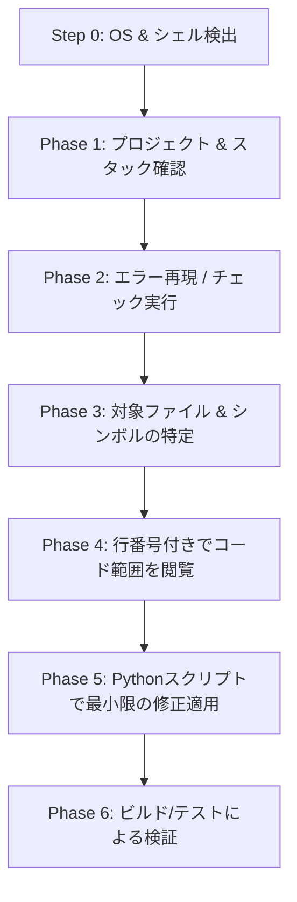

# 🚀 chat-claude-code

> **スマートなターミナル・コピペループにより、あらゆるAIチャットボットをClaude Code CLIに変身させます。**

<p align="left">
  <a href="https://www.supportkori.com/apon133" target="_blank">
    
  </a>
</p>


---

### 🌐 多言語翻訳 / Translations
[ English ](README.md) • [ বাংলা ](README.bn.md) • [ Español ](README.es.md) • [ 简体中文 ](README.zh.md) • [ हिन्दी ](README.hi.md) • [ Français ](README.fr.md) • [ Deutsch ](README.de.md) • [ 日本語 ](README.ja.md) • [ Português ](README.pt.md) • [ Русский ](README.ru.md) • [ العربية ](README.ar.md)

---

**`chat-claude-code`** は、Claude Code CLIなどの自動化ツールを直接利用できない開発者が、標準的なAIチャットボット（Claude Web、ChatGPT、Geminiなど）を使用してローカルターミナル経由でコードベースの調査、デバッグ、リファクタリング、新規プロジェクト作成を行うためのエージェントワークフロースキルです。

---

## 🌟 主な特徴 (Key Features)

- **🔄 ターミナル・コピペループ：** AIが段階的にターミナルコマンドを生成し、貼り付けられた出力を解析して正確なコード修正を実行します。
- **🖥️ 即時OS & シェル検出：** ユーザーに質問することなく、最初のステップでWindows (PowerShell / CMD)、macOS (Zsh / Bash)、またはLinuxを自動検出します。
- **🎯 正確で安全なコード変更：** 完全一致Python置換スクリプト (`assert count == 1`) を使用し、UTF-8エンコーディングと構文を維持しながら安全にコードを編集します。
- **⚡ 単一コマンドでのプロジェクト生成：** アイデア（例：*Flutter + Riverpod*, *Next.js*, *Rust Axum*）を伝えるだけで、1つのコマンドで依存関係のインストールから初期コードの書き出しまで完了します。
- **🛡️ チャットコンテキストの保護：** ターミナルログがAIのコンテキスト長を圧迫しないよう、厳格な出力制限（`head`, `tail`, `cut`）を適用します。

---

## 💡 chat-claude-code を使う理由

| 通常のチャットボットの課題 | chat-claude-code による解決策 |
|---|---|
| **当てずっぽうなコード生成：** 実際のコード構造を見ずに誤ったコードを提案する。 | **まず探索：** 修正を提案する前にプロジェクト構成、設定ファイル、対象行を読み取る。 |
| **コンテキスト上限の超過：** 膨大なターミナル出力を貼り付けると会話が破綻する。 | **厳格な出力バジェット：** コマンド出力を制限（最大40行、1行200文字以内）してトークンを節約。 |
| **シェルの構文エラー：** WindowsユーザーにLinuxコマンドを提示してエラーになる。 | **プラットフォーム自動検出（Step 0）：** 最適なシェル構文を自動選択。 |
| **手動編集ミス：** 長いコードの差し替えを手動で行うとミスが発生しやすい。 | **アトミックPythonスクリプト：** 自動検証付きの置換スクリプトで安全に適用。 |

---

## 🔄 動作の流れ（6フェーズループ）



### 1. Step 0: プラットフォーム検出（初回）
OS、シェル、およびプロジェクトのルートディレクトリを特定する共通コマンドを実行：
```bash
echo "OS=%OS% SHELL=$SHELL OSTYPE=$OSTYPE PS=$PSVersionTable"
git rev-parse --show-toplevel
```

### 2. Phase 1: 探索 (Discover)
主要設定ファイル（`package.json`, `pubspec.yaml`, `Cargo.toml` など）からフレームワークを判定。

### 3. Phase 2: 再現 (Reproduce)
ビルド/チェックコマンド（`npm run build`, `cargo check`, `flutter analyze` 等）を実行し出力をフィルタリング。

### 4. Phase 3 & 4: 特定と閲覧 (Locate & Read)
ファイル名で検索（`git ls-files`）、ソースコード内を検索（`git grep`）し、対象行を行番号付きで表示。

### 5. Phase 5: 修正適用 (Decide & Fix)
安全なPythonスクリプトで最小限のコード修正を適用：

```python
from pathlib import Path
p = Path("src/services/auth.ts")
s = p.read_text(encoding="utf-8")
old = """旧コードブロック"""
new = """新コードブロック"""
assert s.count(old) == 1, f"expected 1 match, found {s.count(old)}"
p.write_text(s.replace(old, new), encoding="utf-8")
print("done")
```

---

## 🚀 利用ガイド

### シナリオ A: 既存プロジェクトのバグ修正
1. **問題を伝える：** *"Next.jsアプリのチェックアウト送信時に500エラーが出ます。"*
2. **AIが提示した検出コマンドを実行**し、出力をチャットに貼り付ける。
3. **AIの指示に従いコマンドを順次実行**し、結果を返す。
4. **修正スクリプトを実行**し、ビルドが通ることを確認。

---

### シナリオ B: アイデアから新規プロジェクトを作成
AIにアイデアを提示：  
*"FlutterとRiverpodを使って習慣記録アプリを作ってください。"*

AIが以下を実行する単一スクリプトを生成します：
1. 必要な開発ツールの確認（`flutter`, `node` 等）。
2. プロジェクトディレクトリの作成と初期化。
3. 必要なパッケージのインストール。
4. 初期コード、画面、状態プロバイダーの自動生成（UTF-8）。
5. 静的解析による動作確認。

---

## 📋 コマンドチートシート (Cheat Sheet)

### 🍏 macOS / 🐧 Linux (`zsh` & `bash`)

| 目的 | コマンド |
|---|---|
| **プラットフォーム検出** | `echo "OS=%OS% SHELL=$SHELL OSTYPE=$OSTYPE PS=$PSVersionTable"` |
| **プロジェクトファイル一覧** | `git ls-files \| head -80` |
| **ファイル名で検索** | `git ls-files \| grep -iE "KEYWORD" \| head -30` |
| **コード内を検索** | `git grep -nI -iE "KEYWORD" -- src app lib \| cut -c1-200 \| head -40` |
| **行範囲の読み取り** | `awk 'NR>=30 && NR<=80 {printf "%d: %s\n", NR, $0}' path/to/file \| cut -c1-200` |
| **エラーのフィルタリング** | `COMMAND 2>&1 \| grep -iE "error\|warning" \| cut -c1-200 \| head -30` |
| **安全なバックアップ** | `cp file.ext file.ext.bak` |

### 🪟 Windows (`PowerShell`)

| 目的 | コマンド |
|---|---|
| **プロジェクトファイル一覧** | `git ls-files \| Select-Object -First 80` |
| **ファイル名で検索** | `git ls-files \| Where-Object { $_ -match 'KEYWORD' } \| Select-Object -First 30` |
| **コード内を検索** | `git grep -nI -iE "KEYWORD" -- src app lib \| ForEach-Object { $_.Substring(0, [Math]::Min(200, $_.Length)) } \| Select-Object -First 40` |
| **行範囲の読み取り** | `$i = 30; Get-Content path\to\file \| Select-Object -Skip 29 -First 51 \| ForEach-Object { "{0}: {1}" -f $i, $_ }` |
| **エラーのフィルタリング** | `COMMAND 2>&1 \| Select-String -Pattern "error\|warning" \| Select-Object -First 30` |
| **安全なバックアップ** | `Copy-Item file.ext file.ext.bak` |

---

## 🔒 セキュリティと安全性の原則

- 🛑 **破壊的コマンドの禁止：** `rm -rf`, `format`, `git reset --hard` 等は明示的な確認なしに実行しません。
- 🛑 **機密情報の非公開：** `.env` ファイルやAPIキーをチャットに入力させることはありません。
- 🛑 **出力制限：** チャットのフリーズを防ぐため、常に適切な行数制限を設けます。
