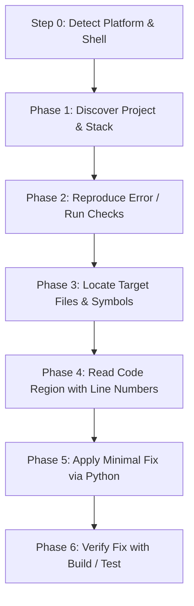

# 🚀 chat-claude-code

> **Turn any AI Chatbot into Claude Code CLI through an intelligent terminal copy-paste loop.**

<p align="left">
  <a href="https://www.supportkori.com/apon133" target="_blank">
    
  </a>
</p>


---

### 🌐 Translations
[ English ](README.md) • [ বাংলা ](README.bn.md) • [ Español ](README.es.md) • [ 简体中文 ](README.zh.md) • [ हिन्दी ](README.hi.md) • [ Français ](README.fr.md) • [ Deutsch ](README.de.md) • [ 日本語 ](README.ja.md) • [ Português ](README.pt.md) • [ Русский ](README.ru.md) • [ العربية ](README.ar.md)

---

**`chat-claude-code`** is an agentic workflow skill and prompt system designed for developers who do not have direct access to automated CLI tools (such as Claude Code CLI) and want to use standard AI chatbots (Claude Web, ChatGPT, Gemini, etc.) to inspect, debug, refactor, and scaffold codebases directly through their local terminal.

---

## 🌟 Key Features

- **🔄 Terminal Copy-Paste Loop:** The AI guides you step-by-step by generating terminal commands, analyzing the output you paste back, and executing exact code changes.
- **🖥️ Instant OS & Shell Detection:** Auto-detects Windows (PowerShell / CMD), macOS (Zsh / Bash), or Linux in the very first step without asking the user.
- **🎯 Precise & Safe Edits:** Uses exact-match Python replace scripts (`assert count == 1`) to ensure code is modified accurately without breaking file syntax or encoding (UTF-8 safe).
- **⚡ One-Command Scaffolding:** Transforms project ideas (e.g., *Flutter + Riverpod*, *Next.js*, *Rust Axum*) into a full starter project with dependencies and files in a single executable command.
- **🛡️ Chat Context Protection:** Implements strict output budgets (`head`, `tail`, `cut`) to prevent terminal logs from flooding the AI's context window.

---

## 💡 Why Use chat-claude-code?

| Challenge with Standard Chatbots | How chat-claude-code Solves It |
|---|---|
| **Blind Guessing:** Chatbots often write incorrect code without seeing the codebase structure. | **Discover First:** Reads the project structure, config files, and exact lines before proposing a fix. |
| **Context Window Overload:** Long terminal dumps and minified files blow up conversation context. | **Hard Output Budget:** Commands are capped (e.g., max 40 lines, 200 chars/line) to protect tokens. |
| **OS / Shell Syntax Errors:** Giving Linux commands to Windows users causes errors. | **Platform Detection (Step 0):** Automatically identifies the shell dialect and sticks to it. |
| **Broken File Edits:** Markdown code blocks are tedious and error-prone to manually apply. | **Atomic Python Scripts:** Runs self-verifying Python scripts to replace exact code blocks safely. |

---

## 🔄 How It Works (The 6-Phase Loop)



### 1. Step 0: Platform Detection (First Turn)
Sends a universal command to detect the operating system, shell, and project root:
```bash
echo "OS=%OS% SHELL=$SHELL OSTYPE=$OSTYPE PS=$PSVersionTable"
git rev-parse --show-toplevel
```

### 2. Phase 1: Discover
Identifies the framework (Node, Flutter, Rust, Python, Go, Android, LaTeX) using marker files (`package.json`, `pubspec.yaml`, `Cargo.toml`, etc.).

### 3. Phase 2: Reproduce
Runs the build/check command (e.g., `npm run build`, `cargo check`, `flutter analyze`) with filtered output.

### 4. Phase 3 & 4: Locate & Read
Finds files by name first (`git ls-files`), then searches within source directories (`git grep`), and displays the relevant line ranges with line numbers.

### 5. Phase 5: Decide & Fix
Applies the smallest change needed using an atomic Python replacement script:

```python
from pathlib import Path
p = Path("src/services/auth.ts")
s = p.read_text(encoding="utf-8")
old = """OLD CODE BLOCK"""
new = """NEW CODE BLOCK"""
assert s.count(old) == 1, f"expected 1 match, found {s.count(old)}"
p.write_text(s.replace(old, new), encoding="utf-8")
print("done")
```

---

## 🚀 Usage Guide

### Scenario A: Debugging an Existing Project
1. **Explain your issue** in the chat:  
   *"I'm getting a 500 error when submitting the checkout form in my Next.js app."*
2. **Run the detection command** provided by the AI and paste back the output.
3. **Execute commands step-by-step** as the AI investigates and pastes the output back into the chat.
4. **Run the provided fix script** and verify that tests/builds pass.

---

### Scenario B: Scaffolding a New Project from an Idea
Tell the AI your concept:  
*"Create a Flutter mobile app with Riverpod for tracking daily habits."*

The AI will generate a single comprehensive setup script that:
1. Verifies tooling prerequisites (e.g., `flutter`, `node`, `cargo`).
2. Creates the project folder and initializes the framework template.
3. Installs required packages and dependencies.
4. Writes all boilerplate code, screens, and state providers with UTF-8 encoding.
5. Runs an initial static analysis check to confirm everything compiles.

---

## 📋 Command Cheat Sheet

### 🍏 macOS / 🐧 Linux (`zsh` & `bash`)

| Purpose | Command |
|---|---|
| **Platform Detection** | `echo "OS=%OS% SHELL=$SHELL OSTYPE=$OSTYPE PS=$PSVersionTable"` |
| **Project Overview** | `git ls-files \| head -80` |
| **Find File by Name** | `git ls-files \| grep -iE "KEYWORD" \| head -30` |
| **Search Inside Source** | `git grep -nI -iE "KEYWORD" -- src app lib \| cut -c1-200 \| head -40` |
| **Read Line Range** | `awk 'NR>=30 && NR<=80 {printf "%d: %s\n", NR, $0}' path/to/file \| cut -c1-200` |
| **Filter Build Errors** | `COMMAND 2>&1 \| grep -iE "error\|warning" \| cut -c1-200 \| head -30` |
| **Safe Backup** | `cp file.ext file.ext.bak` |

### 🪟 Windows (`PowerShell`)

| Purpose | Command |
|---|---|
| **Project Overview** | `git ls-files \| Select-Object -First 80` |
| **Find File by Name** | `git ls-files \| Where-Object { $_ -match 'KEYWORD' } \| Select-Object -First 30` |
| **Search Inside Source** | `git grep -nI -iE "KEYWORD" -- src app lib \| ForEach-Object { $_.Substring(0, [Math]::Min(200, $_.Length)) } \| Select-Object -First 40` |
| **Read Line Range** | `$i = 30; Get-Content path\to\file \| Select-Object -Skip 29 -First 51 \| ForEach-Object { "{0}: {1}" -f $i, $_ }` |
| **Filter Build Errors** | `COMMAND 2>&1 \| Select-String -Pattern "error\|warning" \| Select-Object -First 30` |
| **Safe Backup** | `Copy-Item file.ext file.ext.bak` |

---

## 🔒 Safety & Security Principles

- 🛑 **No Destructive Commands:** Commands like `rm -rf`, `format`, `git reset --hard`, or `git push --force` are prohibited without explicit confirmation and reversible backup steps.
- 🛑 **No Secret Exposure:** Never asks for or displays `.env` files, API keys, keystores, or private tokens.
- 🛑 **No Unbounded Output:** Output is always bounded by line limits to avoid chat session crashes.

---

## 📂 Repository Structure

```
chat-claude-code/
├── chat-claude-code.skill   # Compressed Skill Package (contains SKILL.md)
├── README.md                # English Documentation
├── README.bn.md             # Bengali (বাংলা)
├── README.es.md             # Spanish (Español)
├── README.zh.md             # Chinese (简体中文)
├── README.hi.md             # Hindi (हिन्दी)
├── README.fr.md             # French (Français)
├── README.de.md             # German (Deutsch)
├── README.ja.md             # Japanese (日本語)
├── README.pt.md             # Portuguese (Português)
├── README.ru.md             # Russian (Русский)
└── README.ar.md             # Arabic (العربية)
```
