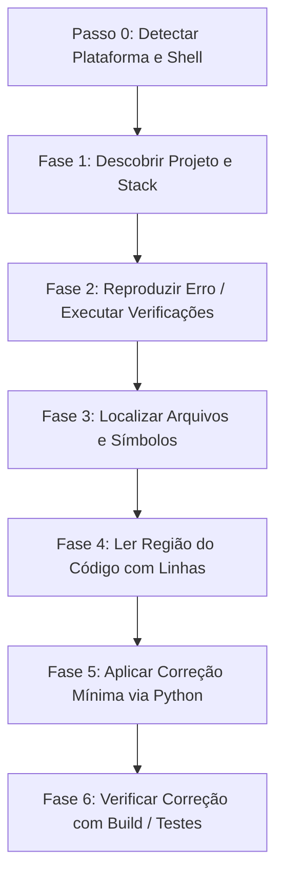

# 🚀 chat-claude-code

> **Transforme qualquer chatbot de IA no Claude Code CLI através de um loop inteligente de copiar e colar no terminal.**

<p align="left">
  <a href="https://www.supportkori.com/apon133" target="_blank">
    
  </a>
</p>


---

### 🌐 Traduções / Translations
[ English ](README.md) • [ বাংলা ](README.bn.md) • [ Español ](README.es.md) • [ 简体中文 ](README.zh.md) • [ हिन्दी ](README.hi.md) • [ Français ](README.fr.md) • [ Deutsch ](README.de.md) • [ 日本語 ](README.ja.md) • [ Português ](README.pt.md) • [ Русский ](README.ru.md) • [ العربية ](README.ar.md)

---

**`chat-claude-code`** é uma habilidade de fluxo de trabalho agêntico e sistema de prompts projetado para desenvolvedores que não têm acesso direto a ferramentas CLI automatizadas (como o Claude Code CLI). Ele permite usar chatbots de IA padrão (Claude Web, ChatGPT, Gemini, etc.) para inspecionar, depurar, refatorar e estruturar bases de código diretamente através do seu terminal local.

---

## 🌟 Principais Recursos

- **🔄 Loop de Copiar e Colar no Terminal:** A IA guia você passo a passo gerando comandos de terminal, analisando a saída que você cola de volta e executando alterações precisas no código.
- **🖥️ Detecção Instantânea de SO e Shell:** Detecta automaticamente Windows (PowerShell / CMD), macOS (Zsh / Bash) ou Linux na primeira etapa, sem perguntar ao usuário.
- **🎯 Edições Precisas e Seguras:** Usa scripts de substituição em Python (`assert count == 1`) para garantir alterações seguras e sem corrupção de sintaxe ou codificação (compatível com UTF-8).
- **⚡ Criação de Projetos em um Único Comando:** Transforma ideias (ex.: *Flutter + Riverpod*, *Next.js*, *Rust Axum*) em um projeto inicial completo com dependências e arquivos gerados em um único comando executável.
- **🛡️ Proteção do Contexto do Chat:** Aplica limites rigorosos de saída (`head`, `tail`, `cut`) para evitar que logs longos estourem a janela de contexto da IA.

---

## 💡 Por que usar o chat-claude-code?

| Desafio com Chatbots Tradicionais | Solução do chat-claude-code |
|---|---|
| **Adivinhação às cegas:** Chatbots escrevem código incorreto sem ver a estrutura real. | **Descobrir primeiro:** Lê a estrutura do projeto, arquivos de configuração e linhas antes de propor uma correção. |
| **Sobrecarga de contexto:** Colar saídas enormes no chat encerra a sessão. | **Orçamento de saída rigoroso:** Limita comandos (máx. 40 linhas, 200 caracteres/linha). |
| **Erros de sintaxe de Shell:** Enviar comandos Linux para Windows causa falhas. | **Detecção de plataforma (Passo 0):** Identifica o dialeto de shell correto automaticamente. |
| **Edições de arquivos quebradas:** Colar código manualmente em arquivos longos gera erros. | **Scripts Atômicos em Python:** Executa scripts de substituição com verificação integrada. |

---

## 🔄 Como Funciona? (O Loop em 6 Fases)



### 1. Passo 0: Detecção de Plataforma (Primeiro Turno)
Envia um comando universal para identificar o sistema operacional, a shell e a raiz do projeto:
```bash
echo "OS=%OS% SHELL=$SHELL OSTYPE=$OSTYPE PS=$PSVersionTable"
git rev-parse --show-toplevel
```

### 2. Fase 1: Descoberta
Identifica o framework (Node, Flutter, Rust, Python, Go, Android, LaTeX) através de arquivos marcadores (`package.json`, `pubspec.yaml`, `Cargo.toml`, etc.).

### 3. Fase 2: Reprodução
Executa comandos de verificação (ex.: `npm run build`, `cargo check`, `flutter analyze`) com saída filtrada.

### 4. Fases 3 e 4: Localização e Leitura
Localiza arquivos pelo nome (`git ls-files`), pesquisa no código-fonte (`git grep`) e exibe o intervalo exato com números de linha.

### 5. Fase 5: Decisão e Correção
Aplica a menor alteração necessária usando um script Python atômico:

```python
from pathlib import Path
p = Path("src/services/auth.ts")
s = p.read_text(encoding="utf-8")
old = """BLOCO DE CODIGO ANTIGO"""
new = """NOVO BLOCO DE CODIGO"""
assert s.count(old) == 1, f"expected 1 match, found {s.count(old)}"
p.write_text(s.replace(old, new), encoding="utf-8")
print("done")
```

---

## 🚀 Guia de Uso

### Cenário A: Depurando um Projeto Existente
1. **Descreva seu problema no chat:** *"Estou recebendo um erro 500 ao enviar o formulário de checkout no meu app Next.js."*
2. **Execute o comando de detecção** fornecido pela IA e cole a resposta.
3. **Execute os comandos passo a passo** conforme a IA investiga.
4. **Aplique o script de correção** e verifique a aprovação da compilação.

---

### Cenário B: Criando um Novo Projeto a partir de uma Ideia
Diga à IA o que deseja criar:  
*"Crie um aplicativo mobile em Flutter com Riverpod para rastrear hábitos."*

A IA gerará um script único que:
1. Verifica os pré-requisitos (`flutter`, `node`, etc.).
2. Cria a pasta do projeto e o template.
3. Instala as dependências necessárias.
4. Gera todo o código inicial, telas e provedores de estado em UTF-8.
5. Executa uma análise estática para confirmar que compila sem erros.

---

## 📋 Folha de Comandos (Cheat Sheet)

### 🍏 macOS / 🐧 Linux (`zsh` e `bash`)

| Objetivo | Comando |
|---|---|
| **Detecção de Plataforma** | `echo "OS=%OS% SHELL=$SHELL OSTYPE=$OSTYPE PS=$PSVersionTable"` |
| **Visão Geral do Projeto** | `git ls-files \| head -80` |
| **Localizar Arquivo por Nome** | `git ls-files \| grep -iE "KEYWORD" \| head -30` |
| **Pesquisar no Código** | `git grep -nI -iE "KEYWORD" -- src app lib \| cut -c1-200 \| head -40` |
| **Ler Intervalo de Linhas** | `awk 'NR>=30 && NR<=80 {printf "%d: %s\n", NR, $0}' path/to/file \| cut -c1-200` |
| **Filtrar Erros de Build** | `COMMAND 2>&1 \| grep -iE "error\|warning" \| cut -c1-200 \| head -30` |
| **Backup Seguro** | `cp file.ext file.ext.bak` |

### 🪟 Windows (`PowerShell`)

| Objetivo | Comando |
|---|---|
| **Visão Geral do Projeto** | `git ls-files \| Select-Object -First 80` |
| **Localizar Arquivo por Nome** | `git ls-files \| Where-Object { $_ -match 'KEYWORD' } \| Select-Object -First 30` |
| **Pesquisar no Código** | `git grep -nI -iE "KEYWORD" -- src app lib \| ForEach-Object { $_.Substring(0, [Math]::Min(200, $_.Length)) } \| Select-Object -First 40` |
| **Ler Intervalo de Linhas** | `$i = 30; Get-Content path\to\file \| Select-Object -Skip 29 -First 51 \| ForEach-Object { "{0}: {1}" -f $i, $_ }` |
| **Filtrar Erros de Build** | `COMMAND 2>&1 \| Select-String -Pattern "error\|warning" \| Select-Object -First 30` |
| **Backup Seguro** | `Copy-Item file.ext file.ext.bak` |

---

## 🔒 Princípios de Segurança

- 🛑 **Sem Comandos Destrutivos:** `rm -rf`, `format`, `git reset --hard` são proibidos sem confirmação e backup prévios.
- 🛑 **Sem Vazamento de Segredos:** Nunca solicita arquivos `.env`, chaves de API ou senhas.
- 🛑 **Saídas Limitadas:** Protege o contexto da IA limitando o tamanho dos logs.
