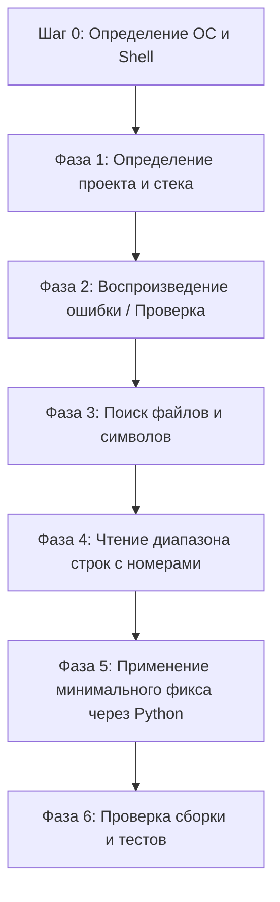

# 🚀 chat-claude-code

> **Превратите любой чат-бот с ИИ в Claude Code CLI с помощью умного цикла «копировать-вставить» через терминал.**

<p align="left">
  <a href="https://www.supportkori.com/apon133" target="_blank">
    
  </a>
</p>


---

### 🌐 Переводы / Translations
[ English ](README.md) • [ বাংলা ](README.bn.md) • [ Español ](README.es.md) • [ 简体中文 ](README.zh.md) • [ हिन्दी ](README.hi.md) • [ Français ](README.fr.md) • [ Deutsch ](README.de.md) • [ 日本語 ](README.ja.md) • [ Português ](README.pt.md) • [ Русский ](README.ru.md) • [ العربية ](README.ar.md)

---

**`chat-claude-code`** — это агентный навык и система инструкций для разработчиков, у которых нет прямого доступа к автоматизированным CLI-инструментам (таким как Claude Code CLI). Она позволяет использовать стандартные веб-чат-боты (Claude Web, ChatGPT, Gemini и др.) для исследования, отладки, рефакторинга и генерации кодовой базы прямо через локальный терминал.

---

## 🌟 Ключевые возможности

- **🔄 Цикл «копировать-вставить» через терминал:** ИИ генерирует команды шаг за шагом, анализирует вывод терминала и выполняет точечные изменения в коде.
- **🖥️ Мгновенное определение ОС и оболочки:** На первом же шаге автоматически определяет Windows (PowerShell / CMD), macOS (Zsh / Bash) или Linux без лишних вопросов пользователю.
- **🎯 Точное и безопасное редактирование кода:** Использует скрипты замены на Python с проверкой точного совпадения (`assert count == 1`), что предотвращает поломку синтаксиса и сохраняет UTF-8 кодировку.
- **⚡ Генерация проекта одной командой:** Превращает идею (например, *Flutter + Riverpod*, *Next.js*, *Rust Axum*) в готовый рабочий проект с установленными зависимостями и файлами за одну команду.
- **🛡️ Защита контекста чата:** Применяет строгие лимиты вывода (`head`, `tail`, `cut`), чтобы длинные логи терминала не переполняли контекстное окно ИИ.

---

## 💡 Почему стоит использовать chat-claude-code?

| Проблема стандартных чат-ботов | Решение в chat-claude-code |
|---|---|
| **Генерация наугад:** ИИ пишет неверный код, не видя реальной структуры проекта. | **Сначала исследование:** Читает файлы конфигурации, дерево файлов и нужные строки. |
| **Переполнение контекста:** Вставка огромных логов ломает сессию чата. | **Лимит вывода:** Команды ограничены (макс. 40 строк, 200 символов/строка). |
| **Ошибки синтаксиса оболочки:** Команды Linux вызывают сбои на Windows. | **Определение платформы (Шаг 0):** Автоматически выбирает подходящий синтаксис. |
| **Ошибки ручного редактирования:** Ручная вставка кода в большие файлы приводит к багам. | **Атомарные скрипты Python:** Выполняет проверенные скрипты автозамены. |

---

## 🔄 Как это работает (6-этапный цикл)



### 1. Шаг 0: Определение платформы (Первый ход)
Отправляет универсальную команду для определения операционной системы, оболочки и корня проекта:
```bash
echo "OS=%OS% SHELL=$SHELL OSTYPE=$OSTYPE PS=$PSVersionTable"
git rev-parse --show-toplevel
```

### 2. Фаза 1: Исследование (Discover)
Определяет фреймворк (Node, Flutter, Rust, Python, Go, Android, LaTeX) по маркерам (`package.json`, `pubspec.yaml`, `Cargo.toml` и др.).

### 3. Фаза 2: Воспроизведение (Reproduce)
Запускает команду проверки или сборки (`npm run build`, `cargo check`, `flutter analyze`) с фильтрацией вывода.

### 4. Фазы 3 и 4: Поиск и чтение (Locate & Read)
Находит файлы по имени (`git ls-files`), ищет вхождения в коде (`git grep`) и выводит нужные строки с номерами.

### 5. Фаза 5: Решение и исправление (Decide & Fix)
Применяет минимальные изменения с помощью безопасного Python-скрипта:

```python
from pathlib import Path
p = Path("src/services/auth.ts")
s = p.read_text(encoding="utf-8")
old = """СТАРЫЙ БЛОК КОДА"""
new = """НОВЫЙ БЛОК КОДА"""
assert s.count(old) == 1, f"expected 1 match, found {s.count(old)}"
p.write_text(s.replace(old, new), encoding="utf-8")
print("done")
```

---

## 🚀 Руководство по использованию

### Сценарий A: Исправление ошибки в существующем проекте
1. **Опишите проблему:** *"В моем Next.js приложении возникает ошибка 500 при отправке формы заказа."*
2. **Запустите команду определения платформы** от ИИ и вставьте ответ в чат.
3. **Выполняйте команды по очереди**, возвращая вывод в чат.
4. **Запустите скрипт исправления** и убедитесь в успешной сборке.

---

### Сценарий B: Создание нового проекта с нуля
Передайте идею ИИ:  
*"Создай мобильное приложение на Flutter с Riverpod для трекинга привычек."*

ИИ сформирует единый скрипт, который:
1. Проверит наличие инструментов (`flutter`, `node` и т. д.).
2. Создаст структуру и шаблон проекта.
3. Установит необходимые зависимости.
4. Запишет стартовый код, экраны и провайдеры в UTF-8.
5. Запустит статический анализ для подтверждения сборки.

---

## 📋 Шпаргалка по командам (Cheat Sheet)

### 🍏 macOS / 🐧 Linux (`zsh` и `bash`)

| Назначение | Команда |
|---|---|
| **Определение платформы** | `echo "OS=%OS% SHELL=$SHELL OSTYPE=$OSTYPE PS=$PSVersionTable"` |
| **Список файлов проекта** | `git ls-files \| head -80` |
| **Поиск файла по имени** | `git ls-files \| grep -iE "KEYWORD" \| head -30` |
| **Поиск в исходниках** | `git grep -nI -iE "KEYWORD" -- src app lib \| cut -c1-200 \| head -40` |
| **Чтение диапазона строк** | `awk 'NR>=30 && NR<=80 {printf "%d: %s\n", NR, $0}' path/to/file \| cut -c1-200` |
| **Фильтрация ошибок сборки** | `COMMAND 2>&1 \| grep -iE "error\|warning" \| cut -c1-200 \| head -30` |
| **Резервная копия** | `cp file.ext file.ext.bak` |

### 🪟 Windows (`PowerShell`)

| Назначение | Команда |
|---|---|
| **Список файлов проекта** | `git ls-files \| Select-Object -First 80` |
| **Поиск файла по имени** | `git ls-files \| Where-Object { $_ -match 'KEYWORD' } \| Select-Object -First 30` |
| **Поиск в исходниках** | `git grep -nI -iE "KEYWORD" -- src app lib \| ForEach-Object { $_.Substring(0, [Math]::Min(200, $_.Length)) } \| Select-Object -First 40` |
| **Чтение диапазона строк** | `$i = 30; Get-Content path\to\file \| Select-Object -Skip 29 -First 51 \| ForEach-Object { "{0}: {1}" -f $i, $_ }` |
| **Фильтрация ошибок сборки** | `COMMAND 2>&1 \| Select-String -Pattern "error\|warning" \| Select-Object -First 30` |
| **Резервная копия** | `Copy-Item file.ext file.ext.bak` |

---

## 🔒 Безопасность и правила

- 🛑 **Никаких деструктивных команд:** `rm -rf`, `format`, `git reset --hard` запрещены без подтверждения.
- 🛑 **Защита секретов:** Никогда не требует ввода файлов `.env`, API-ключей или паролей.
- 🛑 **Контроль вывода:** Вывод терминала всегда ограничивается во избежание сбоев чата.
