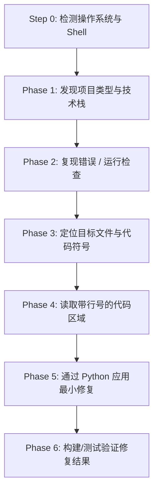

# 🚀 chat-claude-code

> **通过智能终端复制-粘贴循环，将任何 AI 聊天机器人转变为 Claude Code CLI。**

<p align="left">
  <a href="https://www.supportkori.com/apon133" target="_blank">
    
  </a>
</p>


---

### 🌐 多语言翻译 / Translations
[ English ](README.md) • [ বাংলা ](README.bn.md) • [ Español ](README.es.md) • [ 简体中文 ](README.zh.md) • [ हिन्दी ](README.hi.md) • [ Français ](README.fr.md) • [ Deutsch ](README.de.md) • [ 日本語 ](README.ja.md) • [ Português ](README.pt.md) • [ Русский ](README.ru.md) • [ العربية ](README.ar.md)

---

**`chat-claude-code`** 是一个智能代理工作流技能与提示系统，专为无法直接使用自动化命令行工具（如 Claude Code CLI）的开发者设计。它允许你借助标准的 AI 聊天机器人（Claude Web、ChatGPT、Gemini 等），通过本地终端直接对代码库进行检查、调试、重构和脚手架搭建。

---

## 🌟 核心特性

- **🔄 终端复制-粘贴工作流：** AI 逐步生成终端命令，分析你反馈的输出，并执行精准的代码修改。
- **🖥️ 即时操作系统与 Shell 检测：** 第一步无需询问用户即可自动识别 Windows (PowerShell / CMD)、macOS (Zsh / Bash) 或 Linux。
- **🎯 精确且安全的代码编辑：** 使用 Python 单次精确匹配替换脚本 (`assert count == 1`)，确保代码修改准确无误且不损坏文件语法和 UTF-8 编码。
- **⚡ 单命令一键生成项目：** 仅需描述项目想法（如 *Flutter + Riverpod*、*Next.js*、*Rust Axum*），即可通过单条脚本命令生成完整项目结构、安装依赖并写入初始代码。
- **🛡️ 聊天上下文保护：** 实施严格的输出预算控制（`head`、`tail`、`cut`），防止海量终端日志撑爆 AI 的上下文窗口。

---

## 💡 为什么使用 chat-claude-code？

| 普通聊天机器人的痛点 | chat-claude-code 的解决方案 |
|---|---|
| **盲猜代码：** AI 在未见实际代码库结构前随意编写代码。 | **先探索再修改：** 在提出修复方案前先读取项目文件、配置和具体代码行。 |
| **上下文溢出：** 粘贴巨量终端日志导致聊天会话崩溃。 | **严格输出预算：** 命令均带有限制（如最多 40 行，每行最多 200 字符）以节省 Token。 |
| **Shell 语法错误：** 给 Windows 用户提供 Linux 命令导致执行失败。 | **平台自动识别（Step 0）：** 自动选择适配当前系统的 Shell 语法。 |
| **代码修改易出错：** 手动在长文件中查找替换极易出错。 | **原子化 Python 替换脚本：** 执行带自检断言的安全替换脚本。 |

---

## 🔄 工作原理（6 阶段智能循环）



### 1. Step 0: 平台检测（首轮对话）
发送一条通用命令以检测操作系统、Shell 和项目根目录：
```bash
echo "OS=%OS% SHELL=$SHELL OSTYPE=$OSTYPE PS=$PSVersionTable"
git rev-parse --show-toplevel
```

### 2. Phase 1: 发现 (Discover)
通过标志性配置文件（`package.json`, `pubspec.yaml`, `Cargo.toml` 等）识别技术栈。

### 3. Phase 2: 复现 (Reproduce)
运行编译或检查命令（如 `npm run build`, `cargo check`, `flutter analyze`）并过滤输出。

### 4. Phase 3 & 4: 定位与读取 (Locate & Read)
先通过文件名查找（`git ls-files`），再在源码中搜索关键字（`git grep`），最后读取指定行号范围的代码。

### 5. Phase 5: 决策与修复 (Decide & Fix)
通过原子化的 Python 脚本应用最小的必要修改：

```python
from pathlib import Path
p = Path("src/services/auth.ts")
s = p.read_text(encoding="utf-8")
old = """旧代码块"""
new = """新代码块"""
assert s.count(old) == 1, f"expected 1 match, found {s.count(old)}"
p.write_text(s.replace(old, new), encoding="utf-8")
print("done")
```

---

## 🚀 使用指南

### 场景 A：调试现有项目中的 Bug
1. **在聊天中描述问题：** *"在 Next.js 项目中提交结算表单时报 500 错误。"*
2. **运行 AI 给出的平台检测命令**并将输出粘贴回聊天中。
3. **逐步运行 AI 给出的命令**并将终端输出反馈给 AI。
4. **运行 AI 给出的修复脚本**并验证构建通过。

---

### 场景 B：从想法快速生成新项目
告诉 AI 你的想法：  
*"使用 Flutter 和 Riverpod 创建一个习惯打卡移动应用。"*

AI 将生成一个包含完整步骤的单条脚本：
1. 检查必要开发环境（`flutter`, `node` 等）。
2. 创建项目目录并初始化模版。
3. 安装所需的第三方库与依赖。
4. 以 UTF-8 编码写入所有初始代码、界面和状态管理文件。
5. 运行静态代码分析以确保无语法错误。

---

## 📋 常用命令速查表 (Cheat Sheet)

### 🍏 macOS / 🐧 Linux (`zsh` 与 `bash`)

| 用途 | 命令 |
|---|---|
| **平台检测** | `echo "OS=%OS% SHELL=$SHELL OSTYPE=$OSTYPE PS=$PSVersionTable"` |
| **项目文件概览** | `git ls-files \| head -80` |
| **按文件名查找** | `git ls-files \| grep -iE "KEYWORD" \| head -30` |
| **源码内容搜索** | `git grep -nI -iE "KEYWORD" -- src app lib \| cut -c1-200 \| head -40` |
| **读取指定行范围** | `awk 'NR>=30 && NR<=80 {printf "%d: %s\n", NR, $0}' path/to/file \| cut -c1-200` |
| **过滤构建错误** | `COMMAND 2>&1 \| grep -iE "error\|warning" \| cut -c1-200 \| head -30` |
| **安全备份** | `cp file.ext file.ext.bak` |

### 🪟 Windows (`PowerShell`)

| 用途 | 命令 |
|---|---|
| **项目文件概览** | `git ls-files \| Select-Object -First 80` |
| **按文件名查找** | `git ls-files \| Where-Object { $_ -match 'KEYWORD' } \| Select-Object -First 30` |
| **源码内容搜索** | `git grep -nI -iE "KEYWORD" -- src app lib \| ForEach-Object { $_.Substring(0, [Math]::Min(200, $_.Length)) } \| Select-Object -First 40` |
| **读取指定行范围** | `$i = 30; Get-Content path\to\file \| Select-Object -Skip 29 -First 51 \| ForEach-Object { "{0}: {1}" -f $i, $_ }` |
| **过滤构建错误** | `COMMAND 2>&1 \| Select-String -Pattern "error\|warning" \| Select-Object -First 30` |
| **安全备份** | `Copy-Item file.ext file.ext.bak` |

---

## 🔒 安全与准则

- 🛑 **禁止破坏性命令：** 未经明确授权与备份，绝不执行 `rm -rf`、`format`、`git reset --hard`、`git push --force`。
- 🛑 **绝不泄露敏感密钥：** 严禁要求或输出 `.env`、API Key 或密码内容。
- 🛑 **严格限制输出长度：** 始终限制终端输出行数，避免导致会话中断。
